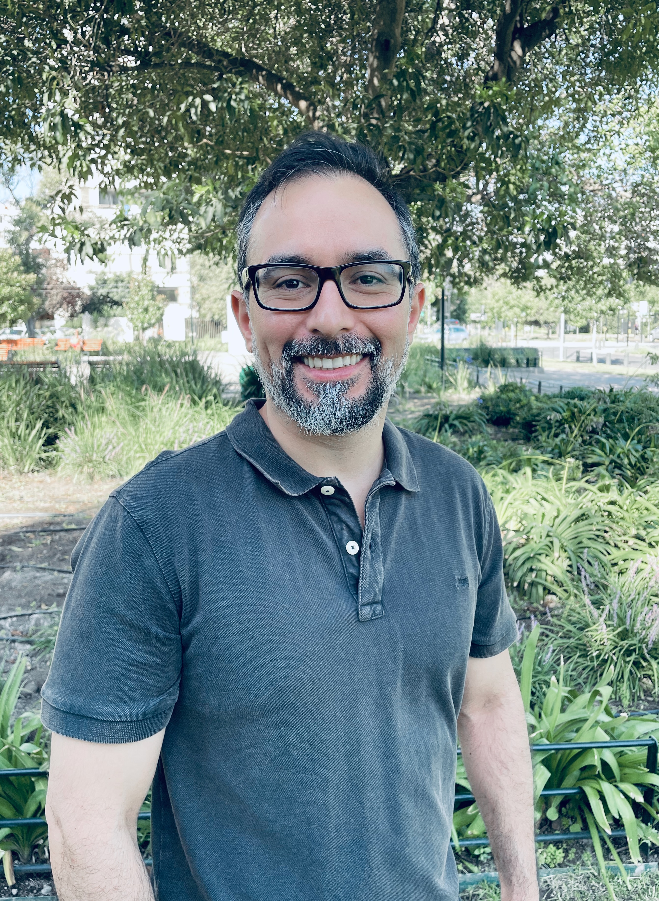

<h1 style="color: #cc0000;">{{ site.jekyllacademic.homepage_title }}Hello World!</h1> 

\
Assistant Professor\
Facultad de Administración y Economía\
Universidad de Tarapacá\
Providencia, Chile

My work focuses on relational relational reasoning and generalization in humans and artificial intelligence systems. I study these issues through experiments with humans and simulations with computational models of the cognitive processes involved in these tasks. Lately, my work as focused on exploring the relational reasoning capabilities of deep neural networks. 

Furthermore, I have a longstanding interest in the psychology of concepts. In collaboration with [Sergio Chaigneau](https://pure.uai.cl/en/persons/sergio-e-chaigneau) and [Nicolás Marchant](https://cscn.uai.cl/equipo/nicolas-marchant-ahumada/) I research the influence of causal knowledge on categorization.

I completed a PhD with [Alex Doumas](https://www.research.ed.ac.uk/en/persons/leonidas-doumas) and [Andrea Martin](https://sites.google.com/site/aemn1011/home) at the University of Edinburgh. I then moved to a post-doctoral position at the University of Bristol working with [Jeff Bowers](https://jeffbowers.blogs.bristol.ac.uk/). Following this moved to a post-doctoral position at [CENIA](https://www.cenia.cl/), and then I moved to my current position of Assistant Professor at Universidad de Tarapacá.

